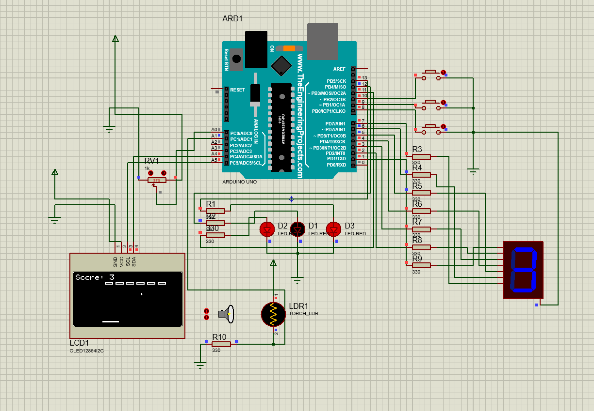

# 🕹️ Arduino Breakout Retro: OLED & 7-Segment Edition

An advanced "Breakout" (Brick Breaker) arcade game built on the **Arduino Uno** platform. This project integrates classic gameplay mechanics with physical hardware interactions, featuring a dynamic level system, digital score tracking, and environmental light sensing.

## 🌟 Key Features

* **Fluid Graphics:** High-frame-rate rendering on an **SSD1306 OLED (128x64)** display via I2C.
* **Adaptive Display (LDR):** Real-time light sensing to **invert colors** automatically based on ambient brightness (Light/Dark mode).
* **Hardware Scoreboard:** Integrated **7-Segment Display** for an external, retro-style digital score readout.
* **Visual Health System:** Three dedicated LEDs indicating the player's remaining lives.
* **5 Progressive Levels:** Each level features unique brick layouts and incremental ball speed increases.
* **Dynamic Power-ups:** Bricks have a 10% chance to drop "Extra Life" items that can be caught with the paddle.

---

## 🛠️ Hardware Components & Pinout

| Component | Purpose | Arduino Pin |
| :--- | :--- | :--- |
| **OLED Display** | Main Game Screen | I2C (SDA/SCL) |
| **Potentiometer** | Paddle (Skateboard) Control | A0 |
| **LDR (Photoresistor)** | Screen Inversion Sensing | A1 |
| **7-Segment Display** | Digital Score Tracking | Pins 1 - 7 |
| **Control Buttons** | Menu Navigation | Pins 8 (Down), 9 (Up), 10 (Select) |
| **Life LEDs** | Health Indicators | Pins 11, 12, 13 |

---

## 📐 Circuit Schematic (Proteus)

The system design was developed and simulated using Proteus. It showcases the wiring for the ATmega328P, the I2C OLED module, and the peripheral sensor array.



---

## 💻 Installation & Usage

1.  **Clone the Repository:**
    ```bash
    git clone [https://github.com/yourusername/arduino-breakout-retro.git](https://github.com/yourusername/arduino-breakout-retro.git)
    ```

2.  **Required Libraries:**
    Ensure you have the following libraries installed in your Arduino IDE:
    * `Adafruit_GFX`
    * `Adafruit_SSD1306`
    * `Wire`

3.  **Compilation:**
    * Open the `.ino` file in Arduino IDE.
    * Select **Arduino Uno** as the board.
    * Connect your device and select the correct **COM Port**.
    * Click **Upload**.

---

## 🎮 How to Play

1.  **Menu Navigation:** Use the **Up/Down** buttons to move the cursor. Press **Select** to start the game.
2.  **Control:** Rotate the **Potentiometer** to move the paddle (skateboard) horizontally.
3.  **Objective:** Destroy all bricks on the screen to advance to the next level.
4.  **Lives:** You start with 3 lives. If the ball falls below the paddle, you lose a life. Catch the falling circular objects to regain health.

---

